# Ant Colony Simulation: Temperature and Food fluctuations

An ant colony simulation made by Matteo Romagnoli for the course Performance Analysis and Simulation of the University of Camerino. 

 

# Index

**[Introduction](#introduction)**

> [Goal](#goal)

**[Assumptions](#section)**

**[The model](#the-model)**

> [Description and dynamics of the
> colony](#description-and-dynamics-of-the-colony)
>
> [Introducing the model](#introducing-the-model)
>
> [Temperature and food influence](#temperature-and-food-influence)
>
> [Population Continuous Time Markov
> Chain](#population-continuous-time-markov-chain)

**[Implementation](#implementation)**

**[Expectations](#expectations)**

**[Results](#results)**

> [Simulation 1](#simulation-1)
>
> [Simulation 2](#simulation-2)
>
> [Simulation 3](#simulation-3)
>
> [Simulation 4](#simulation-4)
>
> [Simulation 5](#simulation-5)
>
> [Simulation 6](#simulation-6)
>
> [Simulation 7](#simulation-7)
>
> [Simulation 8](#simulation-8)
>
> [Simulation 9](#simulation-9)
>
> [Simulation 10](#simulation-10)
>
> [Simulation 11](#simulation-11)
>
> [Simulation 12](#simulation-12)
>
> [Other simulations](#other-simulations)

**[Conclusion](#conclusion)**

**[References](#references)**

 

# Introduction

The ant colony, known as a self-organised system, can adapt to the
environment through negative and positive feedback; however, it is not
clear how ants coordinate. Some studies show that the ant colony is not
a hierarchical system (the queen does not command), but each ant has its
own task, and moreover the communication between ants is limited to an
exchange of deeds (by means of antennas) through which an ant specifies
its role.

The ants are really important for the ecosystem because they:

-   aerate the soil, allowing water and oxygen to reach plant roots;

-   take seeds down into their tunnel to eat the nutritious elaiosomes
     that are part of the seed; These seeds often sprout and grow new
     plants (seed dispersal);

-   eat a wide variety of organic material and provide food for many
     different organisms.

So, we literally can't live without them.

## Goal

The aim of the project is to define and simulate a population model of
an ant colony (a new colony or an already defined colony), paying
attention to the effects of the variation of the temperature and of the
food present in the environment, and see how the ant colony responds to
these changes. Indeed, studies show that these variations have effects
on the speed of workers, on the development of immature ants and on the
reproduction of the queen; the consequences of the effects of the
changes can be summarised as follows:

-   There is no effect of temperature and food on the ant's energy and
     dynamics of the colony population.

-   Temperature elevations (or diminutions) will increase the risk of
     ant colonies dying out because they need to consume more energy to
     sustain themselves.

-   Changes of food availability will affect energy and population
     dynamics of ant colonies.

#  

# Assumptions

A lot of factors are involved in the dynamics of an Ant Colony, and
since we are going to define a model and simulate it, we need to
consider only the major aspect of the ant colony scenario.

We will focus on the work of the ants and the influence of temperature
and food availability, without taking into account this factors:

1.  The temperature inside the nest and outside is the same and does not
     change during the time;

2.  The mass of the ant and the pheromones are abstracted away by using
     the rates;

3.  There is no distinction between water and food; they are both
     considered $\text{Food}$;

4.  It does not exist the season cycle as well as the day-night cycle;

5.  The queen will lay a constant number of eggs each time;

6.  The simulation considers only the part of the year when the ant
     colony is active.

Moreover, we consider an ant colony of *Black Garden Ant* or *Common
Balck Ant* (species *Lasius Niger*), that is monogynous, meaning that
the colonies contain a single queen, and can reach in size up to 2000 -
7000 ants on average during the years. The ant colony will be active
from May to October and will hibernate the other part of the year. In
this type of ant colony there are different kinds of ants, each with a
particular role: the queen, the males, the workers, the soldiers. Since
the males are alive only 1 or 2 days after the mating, and then they
die, we can not take them into account. Also the soldiers are not
represented because we are studying the temperature/food influence of a
single ant colony; this means that there are no conflicts between
colonies.

#  

# The model

To perform the simulation and provide results, we define a population
model representing the rules and behaviours of the system. Since this is
a model, and to maintain it simpler, different properties of the real
word are abstracted away, like the place, the time (day/night cycle),
the change of season... as mentioned before.

We first focus on the agents that interact in the environment and the
dynamics inside the colony, and then we will see the influence of
temperature and food, and finally we will take a look at the relative
population model considering a Population Continuous Time Markov Chain
(PCTMC).

## Description and dynamics of the colony

Given a colony of *Black Garden Ants* it is possible to identify and
consider four main different ants (or roles):

1.  The **queen**: there is only one queen per colony (future queens are
     not taken in consideration), and her purpose is to lay eggs; the
     growth of the colony depends mainly on the fertility of the queen
     and on the efficiency of the worker ants.

2.  The **nurses**: they are a particular kind of [worker]{.ul} ants who
     take care of feeding the larvae and the queen, as well as cleaning
     the nest; these ants always work inside the nest.

3.  The **foragers**: they are the second type of [worker]{.ul} ants
     that take care of looking for and collecting food outside the nest
     and making it available to the whole colony; these ants always
     work outside the nest.

4.  The **larvae**: with larvae we mean immature ants (egg, larva, and
     pupa); the larvae require food to grow and become adult ants; once
     adult, they will become nurses or foragers based on the request in
     the colony.

Each ant has a basal metabolic rate which specifies how much energy is
consumed; furthermore, doing work (gathering food, or giving to eat, or
laying eggs) consumes energy. Of course, an ant dies based on the
energies it has: the more tired and hungry the ant is, the less energy
it will be, the greater the probability of death.

During its life, a nurse ant can change role and become a forager (or
vice versa) according to the needs present in the nest.

## Introducing the model

In order to define a model, and use it in a simulator, we have to
specify the agents and states, the actions they can perform and the
rates of the rules.

In particular, the model contains the following agents: *Queen*,
*Nurse*, *Forager* and *Larva*. These represent the main ants in the
colony and each of them have an energy variable ($e$) that represents
the hungry level of the ant: the more tired and hungry the ant is, the
more greater $e$ will be.

We also have to consider other agents like the *Nest* (or *Home*) that
act as food storage for the colony, the *Death Ants* (that include the
dead foragers, dead nurses and dead queen) and the *Death Larvae*.

We can summarise all the agents and the interaction previously listed
with the following abstract diagram:

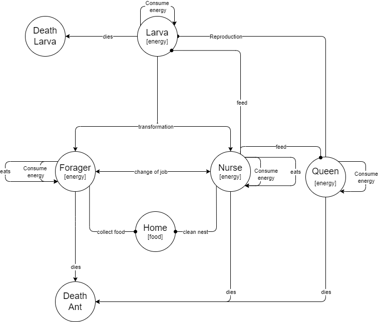

The diagram, that is like a graph, contains nodes labelled with the name
of the agents (the square brackets inside a node is used to define a
parameter) and 2 types of edges:

-   The edge with the arrow, that indicate a change of state/agent using
     a rule; for instance $a - rule \rightarrow b$, meaning "the agent
     *a* performs the rule and becomes the agent *b*", like
     $larva - dies \rightarrow \text{death\ larva}$, meaning "the agent
     $\text{larva}$ performs the rule $\text{dies}$ and becomes the
     agent $\text{death\ larva}$".

-   The edge with the dot, that indicate the interaction with another
     agents; for instance $a - rule - \bullet b$, meaning "the agent
     *a* performs the rule and interacts with the agent *b*", like
     $forager - collect\ food \rightarrow \text{home}$, meaning "the
     agent $\text{forager}$ performs the rule $\text{collect\ food}$
     and interacts with the agent $\text{home}$".

##  

## Temperature and food influence

As mentioned, 2 factors affect an ant colony, and they are the
*temperature* and the *food availability*.

**Temperature**. The ideal temperature for an ant is between 23 and 35
°C (for simplicity we consider the ideal temperature equal to 29 °C and
a maximum variation of ± 10 °C from the average, beyond which the
temperature has greater influence); at these temperatures ants are more
likely to forage for food and keep a colony active (the ant\'s
metabolism is optimal, so it will use less food). The temperature
influences the queen reproduction, the nurses and foragers work, the
metabolism of all the ants and the death probability of larvae.

The influence of temperature is described by the following mathematical
function (that is a Generalised Normal Function):

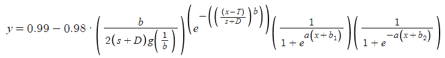

with parameters $b = 4$, $s = 15$, $D = 10$, $g = 0.32$, $T = 29$,
$a = 1$, $b_{1} = - 41$ and $b_{2} = - 11$.

The result is the following curve:

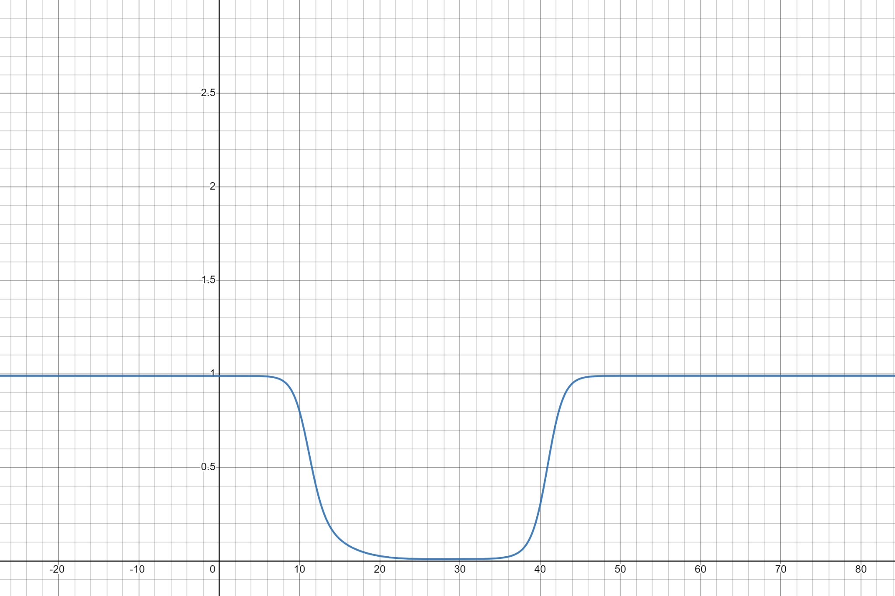

This function ranges between 0 and 1 (0, 1) and it is used in the model
to affect the probability of a rule. We can see, also from the picture,
that from 23 to 35 the function value is near to 0, but as soon as we
move away from it, the function increases exponentially, until the value
reaches \~1 at about 5 and 45.

**Food**. The amount of food present in the environment determines the
survival or not of the colony. The consumption of food depends on the
role of the ant, the metabolism of the ant and the work of the ant.

Of course, the more food there is in the environment, the less time will
be required for harvesting and the more food there will be in the nest.
At the end the colony will survive and grow only if there is enough
food. As soon as the food in the nest runs out, the ants begin to
starve.

The food influences mainly the queen reproduction, the foraging of food
and the change of work (nurse ↔ forager); in particular the last one has
a trend that can be represented by the following mathematical functions:

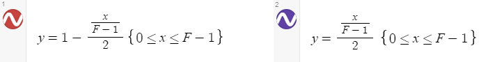

Where $F = 20$ and it is the storage capacity of the nest.

This is the relative chart:

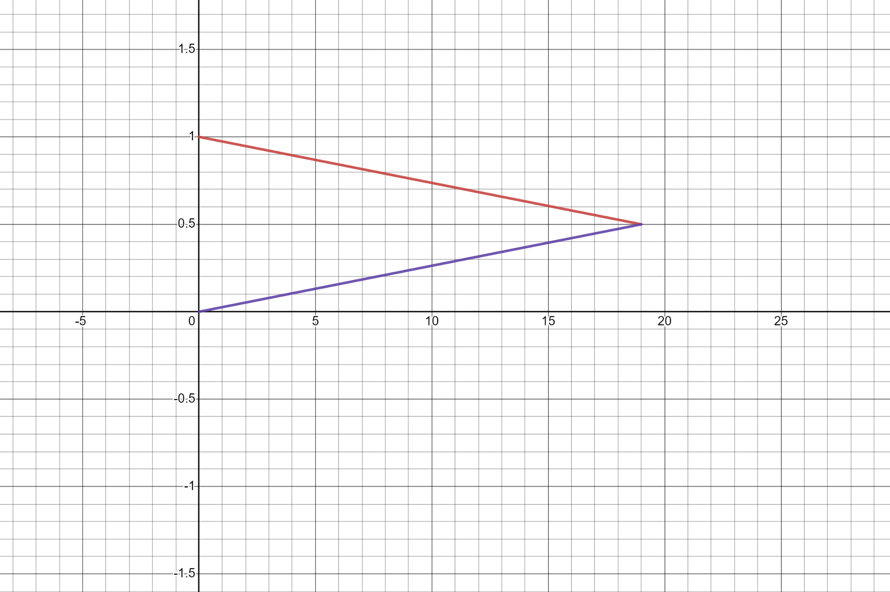

This functions are used to manage the change of work between foragers
and nurses depending on the food available in the nest:

-   In red, the probability that a nurse becomes a forager; it increases
     as soon as the food storage becomes empty.

-   In violet, the probability that a forager becomes a nurse; it
     increases as soon as the food storage is full.

## Population Continuous Time Markov Chain

In this section it is defined the PCTMC of the Ant Colony; the model is
defined as the tuple $M = (X,\ D,\ T,\ d_{0})$, where $X$ is the vector
variables, $D$ is the counting domain, $T$ is the transition rules and
$d_{0}$ is the initial configuration.

Vector Variables

$H\lbrack 0,\ Food\rbrack$, $Q\lbrack 0,\ Energy\rbrack$,
$L\lbrack 0,\ Energy\rbrack$, $N\lbrack 0,\ Energy\rbrack$,
$F\lbrack 0,\ Energy\rbrack$, $\text{DL}$, $\text{DA}$

Counting Domain
$(0,\ N_{h})\ x\ (0,\ N_{q})\ x\ (0,\ N_{l})\ x\ (0,\ N_{n})\ x\ (0,\ N_{f})\ x\ (0,\ N_{\text{dl}})\ x\ (0,\ N_{\text{da}})$

Initial State

$(1,\ 1,N_{l},N_{n},\ N_{f},\ 0,\ 0)$

Transition rules

1.  $queen\ lays\ eggs,\ 1Q\ 1H,\ 1Q\lbrack + 1\rbrack\ 1H\ 15L,\ \left( \lambda_{\text{queenFertility}} - \frac{\text{tI}}{5} \right)\  \cdot \ fS\  \cdot \ e\  \cdot \ cS\  \cdot \ \% L$

2.  $queen\ consume\ energy,\ 1Q,\ 1Q\lbrack + 1\rbrack,\ \lambda_{\text{queenConsumeEnergy}} + \frac{\text{tI}}{2}$

3.  $larva\ consume\ energy,\ 1L,\ 1L\lbrack + 1\rbrack,\ \lambda_{\text{larvaConsumeEnergy}} + \frac{\text{tI}}{2}$

4.  $nurse\ consume\ energy,\ 1N,\ 1N\lbrack + 1\rbrack,\ \lambda_{\text{nurseConsumeEnergy}} + \frac{\text{tI}}{2}$

5.  $forager\ consume\ energy,\ 1F,\ 1F\lbrack + 1\rbrack,\ \lambda_{\text{foragerConsumeEnergy}} + \frac{\text{tI}}{2}$

6.  $nurse\ eats,\ 1H\ 1N,\ 1H\lbrack - 1\rbrack\ 1N\lbrack - 1\rbrack,\ \lambda_{\text{eat}}\  \cdot \ e$

7.  $forager\ eats,\ 1H\ 1F,\ 1H\lbrack - 1\rbrack\ 1F\lbrack - 1\rbrack,\ \lambda_{\text{eat}}\  \cdot \ e$

8.  $nurse\ feeds\ queen,\ 1N\ 1Q\ 1H,\ 1N\lbrack + 1\rbrack\ 1Q\lbrack - 1\rbrack\ 1H\lbrack - 2\rbrack,\ \lambda_{\text{nurseFeedsQueen}}\  \cdot \ \% N$

9.  $nurse\ feeds\ larva,\ 1N\ 1L\ 1H,\ 1N\lbrack + 1\rbrack\ 1L\lbrack - 1\rbrack\ 1H\lbrack - 1\rbrack,$\
     $\left( \lambda_{\text{nurseFeedsLarva}} - \frac{\text{tI}}{2} \right)\  \cdot \ fS\  \cdot \ \% N$

10. $nurse\ cleans\ nest,\ 1N\ 1H\ 1DL,\ 1N\ 1H\lbrack + 1\rbrack,\ \left( \lambda_{\text{nurseCleans}} - \frac{\text{tI}}{2} \right)\  \cdot \ \% DL$

11. $forager\ collects\ food,\ 1F\ 1H,\ 1F\lbrack + 1\rbrack\ 1H\lbrack + 2\rbrack,\ \left( \lambda_{\text{foragerWorks}} - \frac{\text{tI}}{2} \right)\  \cdot \ fA\  \cdot \ \% F$

12. $queen\ dies,\ 1Q,\ 1DA,\ \lambda_{\text{queenDeath}}\  \cdot \ cS$

13. $larva\ dies,\ 1L,\ 1DL,\ \frac{\left( \lambda_{\text{larvaDeath}}\  \cdot \text{\ e} \right)}{3}\  + \ \frac{2\  \cdot \text{\ tI}}{3}$

14. $nurse\ dies,\ 1N,\ 1DA,\ \lambda_{\text{workerDeath}}\  \cdot \ e$

15. $forager\ dies,\ 1F,\ 1DA,\ \lambda_{\text{workerDeath}}\  \cdot \ e$

16. $larva\ becomes\ forager,\ 1L,\ 1F,\ \lambda_{\text{larvaGrows}} \cdot \% L\ $

17. $larva\ becomes\ nurse,\ 1L,\ 1N,\ \lambda_{\text{larvaGrows}}\  \cdot \% L$

18. $nurse\ becomes\ forager,\ 1N,\ 1F,\ \lambda_{\text{changeOfWork}}\  \cdot (1 - \% fS\  + \ sA)\  \cdot \ \% N$

19. $forager\ becomes\ nurse,\ 1F,\ 1N,\ \lambda_{\text{changeOfWork}}\  \cdot (\% fS\  + \ sA)\  \cdot \ \% F$

Where:

-   $\text{Food}$ is a constant and represents the capacity of the food
     storage of the colony.

-   $\text{Energy}$ is a constant and represents the hungry levels of an
     ant.

-   $H$ is the Home (or nest) of the colony; the parameter
     $H\lbrack\rbrack\  = \ fS$ represent the food inside the nest.

-   $Q$ is the Queen of the colony; the parameter
     $Q\lbrack\rbrack\  = \ e$ represent the hungry level of the queen.

-   $L$ are the larvae (eggs, pupa, and larva); the parameter
     $L\lbrack\rbrack\  = \ e$ represent the hungry level of the larva.

-   $N$ are the nurses; the parameter $N\lbrack\rbrack\  = \ e$
     represent the hungry level of the nurse.

-   $F$ are the foragers; the parameter $F\lbrack\rbrack\  = \ e$
     represent the hungry level of the forager.

-   $\text{DL}$ are the death larvae

-   $\text{DA}$ are the death ants (queen, foragers, and nurses)

-   $fS\  \in \ \{\ x\  \in \ N\ |\ 0\  \leq \ x < 10\ \}$ is the *food
     storage level* and represents how much food is stored in the nest;
     this is a [global]{.ul} parameter that depends on $H$. The higher
     is $\text{fS}$, the more food will be in the nest.

-   $e\  \in \ \{\ x\  \in \ N\ |\ 0\  \leq \ x < 10\ \}$ is the *energy
     level* of the ant and represents how much an ant is hungry; this
     is a [local]{.ul} parameter (depends on the ant). The higher is
     $e$, the hunger will be the ant.

-   $tI\  \in \ \{\ x\  \in \ R\ |\ 0\  \leq \ x\  \leq \ 1\ \}$ is the
     *temperature influence*; this is a [global]{.ul} parameter. The
     higher is $\text{tI}$, the more the ants are negatively affected.

-   $fA\  \in \ \{\ x\  \in \ R\ |\ 0\  \leq \ x\  \leq \ 1\ \}$ is the
     *food availability* and represents how much food there is in the
     environment; this is a [global]{.ul} parameter. The higher is
     $\text{fA}$, the more food there is in the environment.

-   $cS\  \in \ \{\ x\  \in \ R\ |\ 0\  \leq \ x\  \leq \ 1\ \}$ is the
     *colony size* and represents how bigger the colony is with respect
     to the standard; this is a [global]{.ul} parameter.

-   $sA\  \in \ \{\ x\  \in \ R\ |\ 0\  \leq \ x\  \leq \ 1\ \}$ is the
     *starve ants* and represents the percentage of the population that
     is starving; this is a [global]{.ul} parameter. The higher is
     $\text{sA}$, the more ants are starving.

   

# Implementation

The implementation of the model is made by using the tool
[*[Sibilla]{.ul}*](https://github.com/quasylab/sibilla).

  

# Expectations

From the studies and observations we know that an Ant Colony:

-   Grows quickly in perfect conditions, in both case of a new colony or
     an old one;

-   Dies if in an hostile environment (like miss of food or pretty
     low/high temperature), in both case of a new colony or an old one;

-   In a environment with middle condition the colony try to survive; in
     particular at around 12 °C

    -   a big colony can survive if food is not a problem

    -   a medium colony only survive for a period of time

    -   a small colony will die after a while

 We have similar scenarios when food is lacking but the temperature is
 favourable.

 

# Results

The simulations take place in 1000 time units that correspond to about 6
months (180 days, when the colony is active) with a delta time of 1
unit. In order to make the simulation more general, it is reproduced 10
times (10 replicas for each simulation).

For each simulation we collect the *summary statistic* of different
measures regarding:

-   the number and percentage (with respect the population) of foragers;

-   the number and percentage (with respect the population) of nurses;

-   the number and percentage (with respect the population) of larvae;

-   the number of alive ants (only queen, foragers and nurses);

-   the number of dead ants (only queen, foragers and nurses);

-   the number of dead larvae (only larvae);

-   the number of agents (only queen and larvae) that are starving.

-   the home's number in a particular state
     ($H\lbrack 0\rbrack,\ H\lbrack 1\rbrack\ ...\ H\lbrack 19\rbrack$)

Each file contains 4 fields, that are the *time step* (from 0 to 999),
the *mean* of the collected value, the *variance and* the *standard
deviation.*

During the simulation the temperature and the food availability
parameters [do not change]{.ul}.

We take in consideration 12 simulations, 6 simulations with a *new
colony* (consisting of the queen, 20 larvae, 10 foragers and 10 nurses)
and 6 simulation with a *old colony* (consisting of the queen, 20
larvae, 100 foragers and 100 nurses), all of which they start with a
nest full of food, and each of which designing a scenario (different
temperature and food availability).

Five charts have been defined for each simulation:

1.  ***General View*** representing the trend of the colony during the
     time (is the colony dying or not?);

2.  ***Ants Distribution*** representing the distribution of the roles
     in the colony during the time (how much foragers, nurses and
     larvae are there?);

3.  ***Deaths*** representing the number of death ants and death larvae
     during the time;

4.  ***Food Fluctuation*** representing the amount of food stored in the
     nest, and the relative trend, during the time;

5.  ***Hunger Colony Distribution*** representing the amount of ants,
     foragers and starve agents, and the relative amount of food in the
     nest (plus the trend), during the time.

##  

## Simulation 1

A new colony in an ideal environment where
$Temperature\  = \ 29\ {^\circ}C$ and $Food\ availability\  = \ 1$.

As we can imagine, in ideal conditions, the ant colony will grow
quickly. Since there is a lot of food, the food storage never becomes
empty, moreover remains always half full (as we can see in the food
fluctuation chart), and the number of nurses and foragers are more or
less equally distributed (number of nurses is almost the same as the
number of foragers). In the last graph we can see that the population is
not
starving.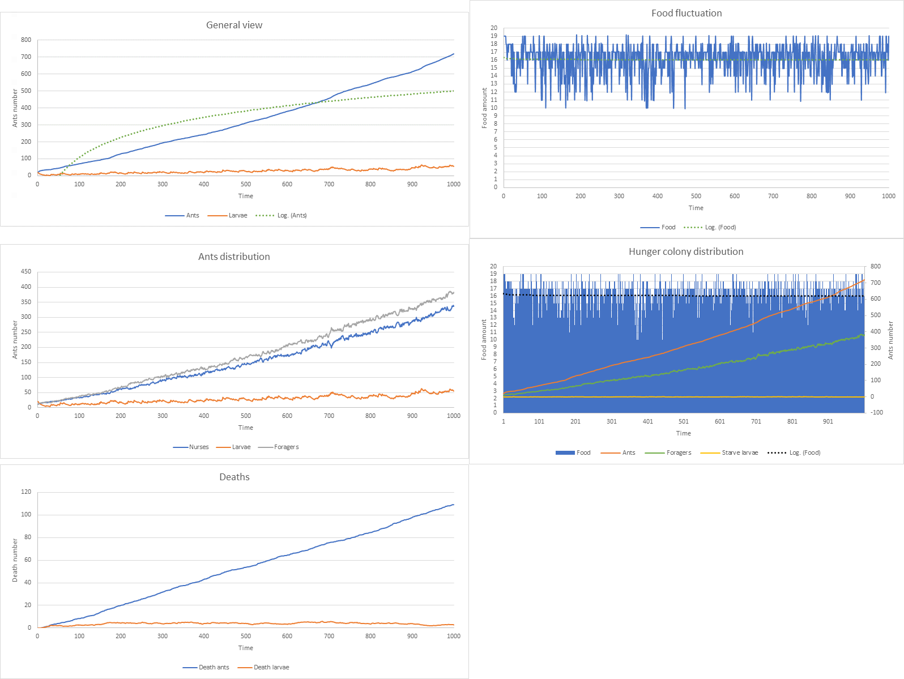

## Simulation 2

A new colony in an environment where $Temperature\  = \ 29\ {^\circ}C$
and $Food\ availability\  = \ 0.5$.

Also in this case, the ant colony will grow, however it is slower than
the first. Since here the problem is the food, the food storage tends to
become empty (as we can see in the food fluctuation chart), but at the
same time, the number of foragers increases with respect to the nurses.
In the last graph we can see that the population is not starving, but
sometimes, we can notice some peaks (\~5 agents).

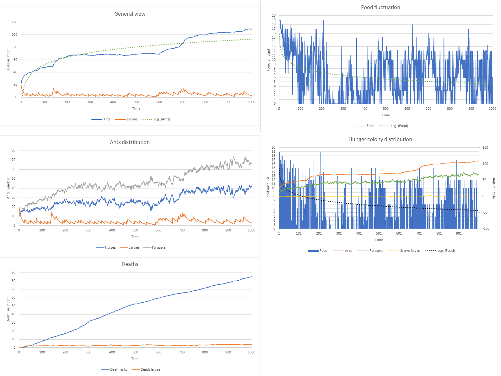

## Simulation 3

A new colony in an environment where $Temperature\  = \ 12.5\ {^\circ}C$
and $Food\ availability\  = \ 1$.

In this scenario, the ant colony will grow really slow. We can observe
that the number of death ants overcome the number of alive ants (at the
end). Also if the food is not a problem, the temperature requires a
constant and large amount of food to eat, and this is visible in the
Food Fluctuation graph: the food storage is always empty, because the
ants eat all the available food in order to survive.

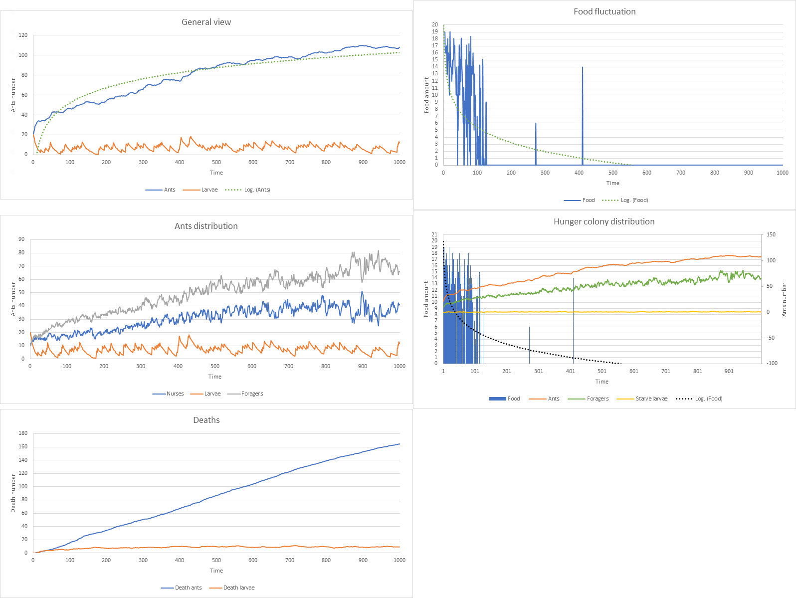

## Simulation 4

A new colony in an environment where $Temperature\  = \ 12.5\ {^\circ}C$
and $Food\ availability\  = \ 0.5$.

In this case the whole ant colony dies after about 200 time units (\~36
days). Also if there are more foragers to harvest for food, the request
for food is so high that the colony dies. We have to keep in mind that
initially the colony has only 20 workers.

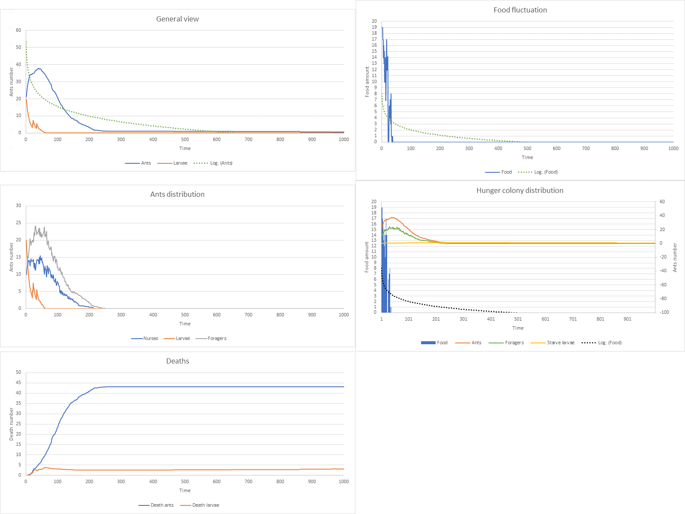

## Simulation 5

A new colony in an environment where $Temperature\  = \ 5\ {^\circ}C$
and $Food\ availability\  = \ 1$.

As we can imagine, in these conditions the colony dies after a while
(\~30 days).

## Simulation 6

A new colony in an hostile environment where
$Temperature\  = \ 5\ {^\circ}C$ and $Food\ availability\  = \ 0.5$.

As we can imagine, in these conditions the colony dies after a while
(\~30 days).

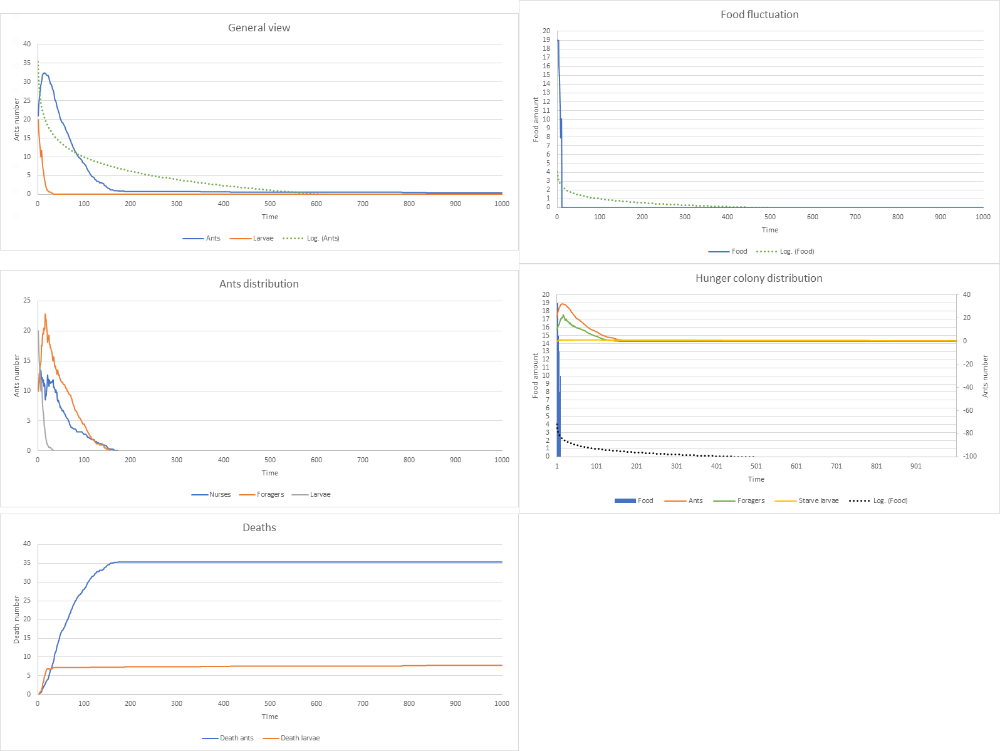

## Simulation 7

A old colony in an ideal environment $Temperature\  = \ 29\ {^\circ}C$
and $Food\ availability\  = \ 1$.

In this simulation, with the ideal conditions, the ant colony will grow,
of course. Since there is a lot of food, the food storage never becomes
empty, moreover remains always full (as we can see in the food
fluctuation chart), and the number of nurses and foragers are more or
less equally distributed (number of nurses is almost the same as the
number of foragers). In the last graph we can see that the population is
not starving. This scenario is similar to the small colony in the same
condition (*Simulation 1*).

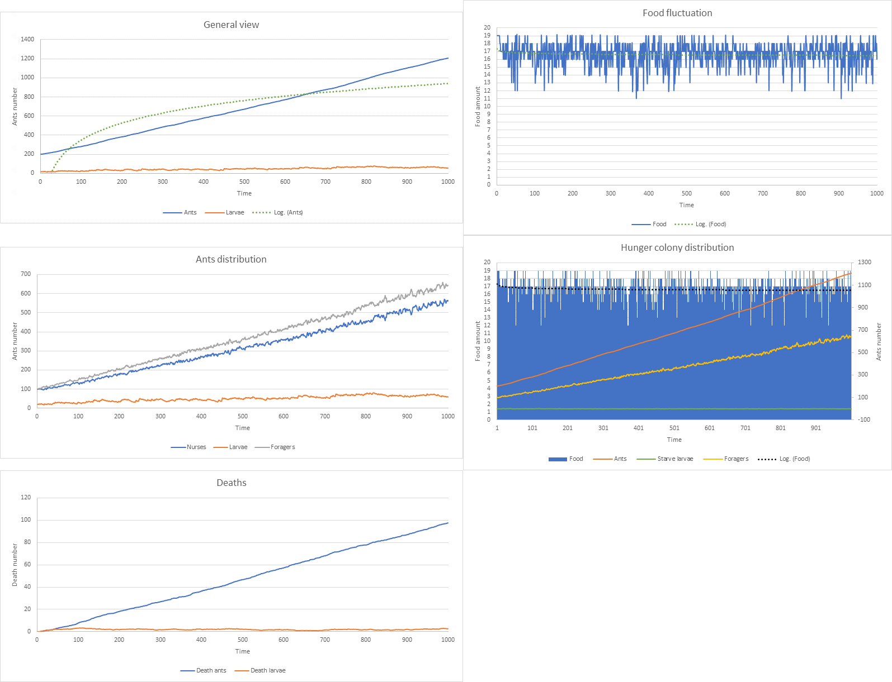

## Simulation 8

A old colony in an environment where $Temperature\  = \ 29\ {^\circ}C$
and $Food\ availability\  = \ 0.5$.

Respect to *Simulation 2*, the colony grows faster because of the number
of initial workers. As soon as we move till the end (1000 time units),
the food storage tends to become empty; for this reason, there is a big
gap between foragers and nurses.

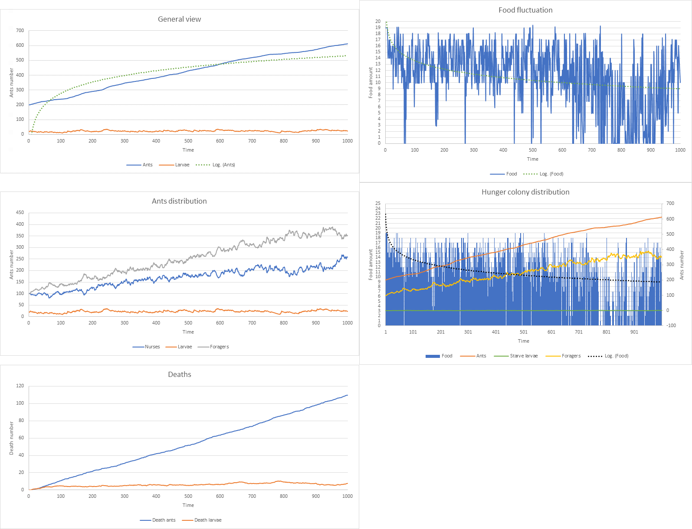

## Simulation 9

A old colony in an environment where $Temperature\  = \ 12.5\ {^\circ}C$
and $Food\ availability\  = \ 1$.

In this scenario, the ant colony will grow slowly. Respect to
*Simulation 3*, in this case, the food storage rarely becomes empty.
This means that an old (or bigger) colony is better able to survive than
a new (or small) colony.

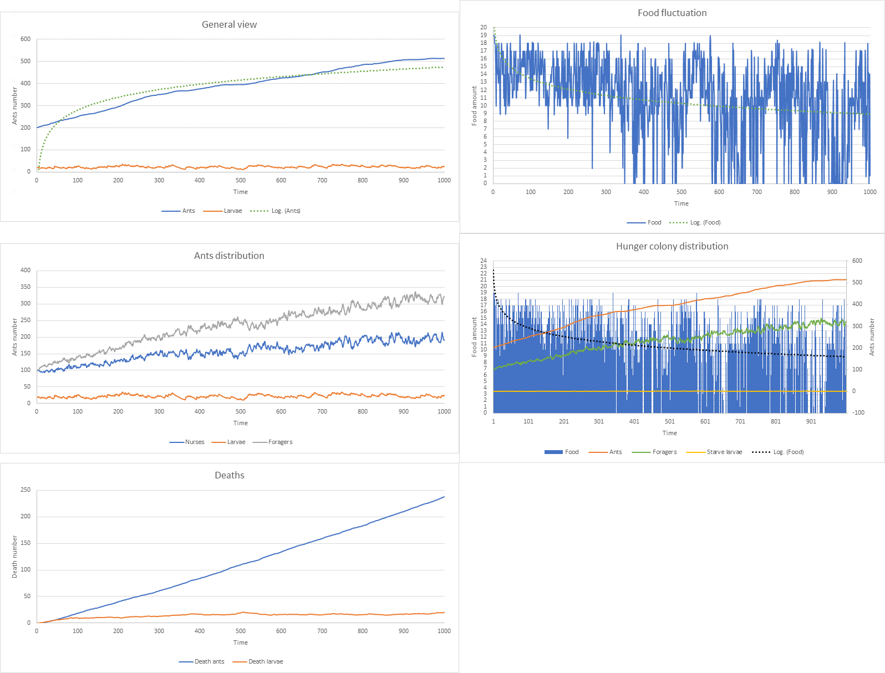

## Simulation 10

A old colony in an environment where $Temperature\  = \ 12.5\ {^\circ}C$
and $Food\ availability\  = \ 0.5$.

In this simulation the ant colony is slowly dying. This is because at
the end the queen dies (the larvae are no more generated as we can see
in the Ants Distribution graph). However, if the colony is bigger or the
time under this condition is shorter, then the colony may survive.

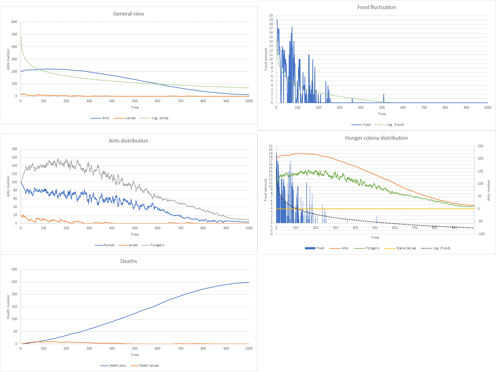

## Simulation 11

A old colony in an environment where $Temperature\  = \ 5\ {^\circ}C$
and $Food\ availability\  = \ 1$.

As we can imagine, in these hostile conditions, the ant colony will die
not so fast. The queen dies after 200 time units (\~36 days), and then
the whole colony dies after 700 time units (\~126 days).

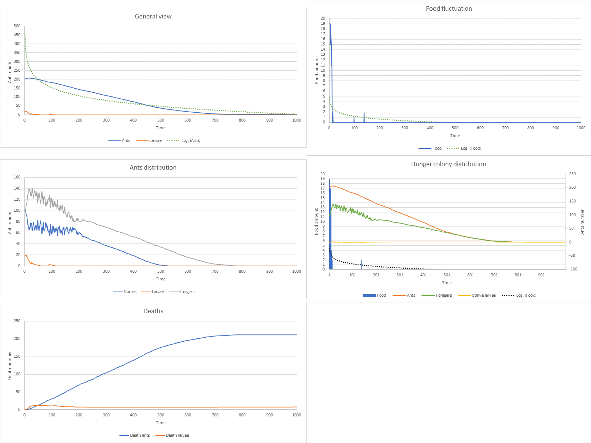

## Simulation 12

A old colony in an hostile environment where
$Temperature\  = \ 5\ {^\circ}C$ and $Food\ availability\  = \ 0.5$.

As we can imagine, in these hostile conditions, the ant colony dies
quickly: after 100 time units the queen dies (\~18 days), and after that
all the ants in the colony (in around 500 time units, or \~90 days).
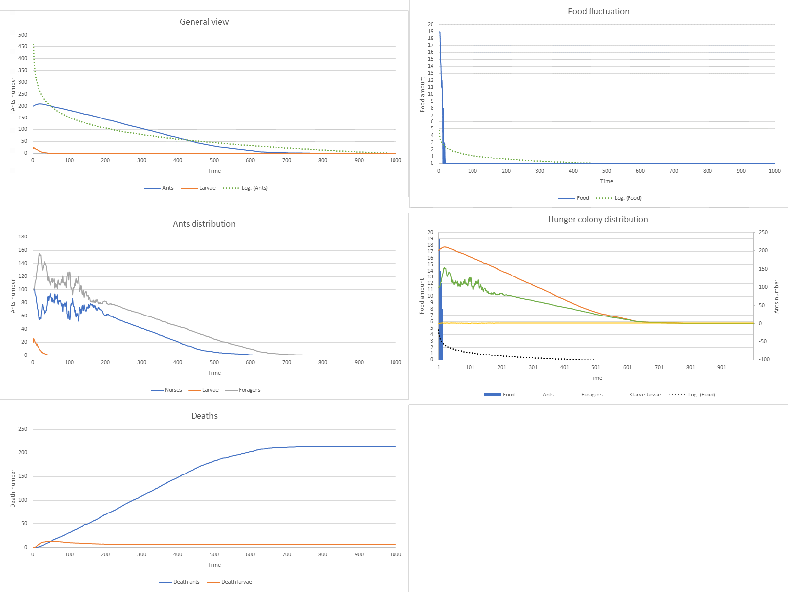

 

## Other simulations

We can investigate more on what happens in an [old colony]{.ul} when the
temperature varies from 11 °C to 13 °C and food availability is 1.

# 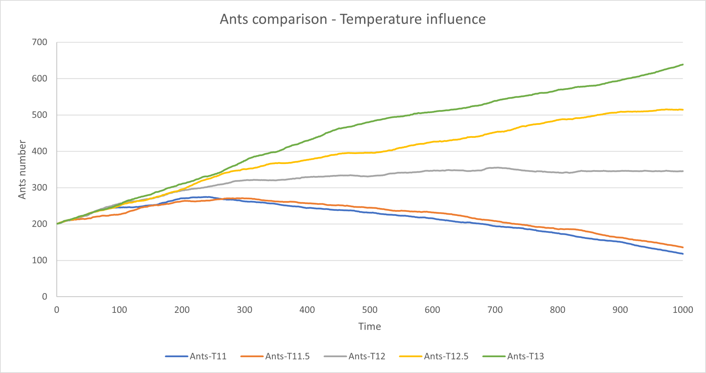

We can observe that as soon as the temperature overcomes 12 °C the ant
colony starts growing; at 12 °C the colony remains stationary and below
this temperature, the colony dies.

While in the [new colony]{.ul}, we have this graph:

# 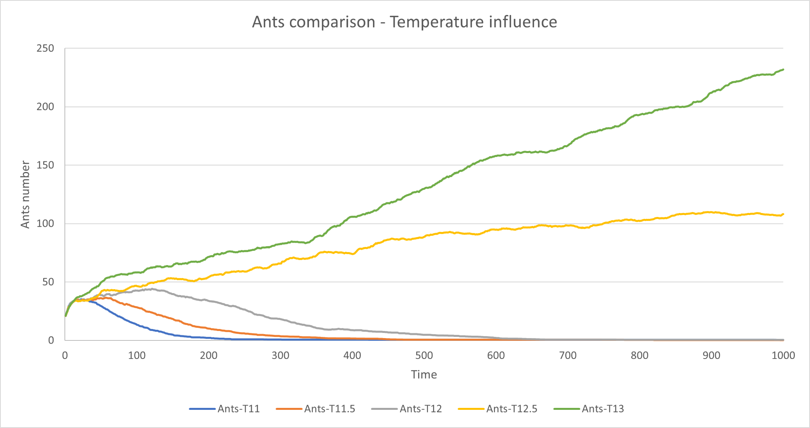

Essentially, the small colony, in order to survive, requires a
temperature 0.5 °C greater than the older one.

 

# Conclusion

By changing the temperature and food availability, the model revealed
the impact on the ant colony.

Increasing the temperature can boost the colony speed, because it will
speed up the workers, the queen reproduction, the development speed of
larvae... However, moving far away from the ideal temperature
(increasing or decreasing the temperature) will cause the degradation of
the colony, because the metabolism will increase as well as the
activities' speed of the ants decrease. Moreover the ant colony in an
hostile environment will use more food than another in a moderate
environment.

In an environment with the same conditions, a small colony will be
disadvantaged over a bigger one. The scarce resources will increase
colonies' risk for dying out. Nevertheless, the rich food sources could
protect ant colonies from food shortage and starvation.

  

# References

[[https://harvardforest.fas.harvard.edu/ants/life-cycle]{.ul}](https://harvardforest.fas.harvard.edu/ants/life-cycle)

[[https://onlinelibrary.wiley.com/doi/full/10.1111/gcb.16140]{.ul}](https://onlinelibrary.wiley.com/doi/full/10.1111/gcb.16140%20)

[[https://zoologicalstudies.springeropen.com/articles/10.1186/s40555-014-0040-4]{.ul}](https://zoologicalstudies.springeropen.com/articles/10.1186/s40555-014-0040-4)

[[https://www.antwiki.org/wiki/Life_in_an_Ant_Colony]{.ul}](https://www.antwiki.org/wiki/Life_in_an_Ant_Colony)

[[https://www.ncbi.nlm.nih.gov/pmc/articles/PMC4951116]{.ul}](https://www.ncbi.nlm.nih.gov/pmc/articles/PMC4951116)

[[https://www.terminix.com/ants/behavior/do-ants-hibernate]{.ul}](https://www.terminix.com/ants/behavior/do-ants-hibernate)

[[https://www.ted.com/talks/deborah_gordon_the_emergent_genius_of_ant_colonies]{.ul}](https://www.ted.com/talks/deborah_gordon_the_emergent_genius_of_ant_colonies)

[[https://dc.etsu.edu/cgi/viewcontent.cgi?article=3757&context=etd]{.ul}](https://dc.etsu.edu/cgi/viewcontent.cgi?article=3757&context=etd)

[[https://harvardforest.fas.harvard.edu/ants/ecological-importance]{.ul}](https://harvardforest.fas.harvard.edu/ants/ecological-importance)
